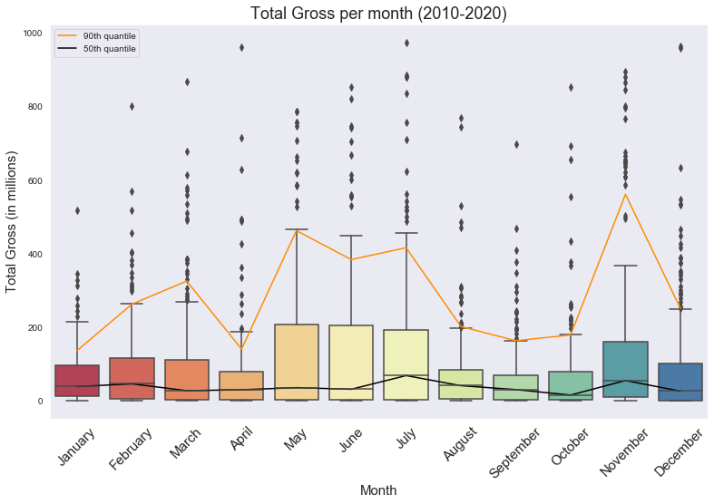

# Phase 1 Final Project Film Industry Analysis

Welcome to my readme. In this file I will give a run through of how I performed my analysis and what it is that I covered throughout the course of the project. This is my first project while at Flatiron and I am fairly excited! This was an analysis on various parts of the movie industry. At the moment of writing this, I still consider myself fairly green, but I love what I'm learning so far!

# Non technical presentation slide deck link

https://docs.google.com/presentation/d/1LTSSU2Gk86Ca4eJZjK8N9tHo0usWDh8CRZ15IVhZMws/edit?usp=sharing

# Non technical video presentation link

https://drive.google.com/file/d/19omiAY09Y00IRFMHt_tztfkb1IBL8jCJ/view

## Relevant File Contents Within this Repository
The Data
* zippedData/ - Contains the Raw Data used in the analysis \n
* cleaneddata/ - Contains the Cleaned and joined data used in my analysis

The Notebooks - will go into detail later below
* DataCleaning.ipynb - Contains my data cleaning process before the analysis and what produced the files in cleaneddata
* Phase01ProjectGenreRegion.ipynb - This contains the questions I decided to answer related to the genres and how they affect movie peformance
* Phase01ProjectInvestmentRatio.ipynb - Here I did a further delve into what makes a project successful by looking at the relationship between production budget and total gross. I then decided to look at that relationship per genre as well
* Phase01ProjectIdealReleaseTime.ipynb - Contains data in my analysis of if there is an ideal time to release a movie, looking at both the month and day for my analysis
* Phase01ProjectRisingStars.ipynb - name is a little misleading for what I ended up using it for. Here I looked at what films within the past 5 years have been very successful in ratings with a considerable number of votes and see who are the actors that most appeared in that group. From there, we identified who should be people who we choose to collaborate with

Other
* Phase01ProjectSlideDeck.pdf - contains a pdf of my non technical presentation

## Our scenario

### Business Problem

Microsoft sees all the big companies creating original video content, and they want to get in on the fun. They have decided to create a new movie studio, but the problem is they don’t know anything about creating movies. They have hired you to help them better understand the movie industry.
Your team is charged with exploring what type of films are currently doing the best at the box office. You must then translate those findings into actionable insights that the head of Microsoft's new movie studio can use to help decide what type of films to create.

# Notebooks and the questions they answer

## Phase01ProjectGenre
### What genres are highly rated?
Here we explode the genres column and then group all of our data by the genres. When we look to see what are the highest rated genres, we see that the top 5 genres are News, Documentary, Biography, History, and Music. 

#### Why is this?
Intuitively, these columns sound a lot more unique and distinct than something like action or adventure. Perhaps the people most inclined to watch these genres of movies, are ones that would be invested in watching. Also, with extra data, we could analyze how expectations of a certain genre affect the rating. For example, Horror movies are, on average, the lowest rated movie genre. People watch a horror movie expecting to get scared; if a movie does not meet the expectations of the viewers, it will receive a lower rating.
### What genres have the highest Gross?
I looked at worldwide gross average of the genres to see which genres were the highest performing. We found that the top 6 genres of movies with the highest gross are Sci-Fi, Adventure, Animation, Action, Fantasy and Family. We looked at the both the mean and median for this. We used the median to account more accurately for any large outliers that may have been in our data.

# Phase01ProjectInvestmentRatio
## Is There a Relationship Between Production Cost and Gross
I wanted to see if there was a relationship between the two. We found there to be a positive correlation between the two. The majority of the films just about break even.

## What Genre has the highest rate of return?
We once again looked at the genres to see which genres had the highest return on what is initially put in.

From this we can see that horror movies have the highest rate on this. I believe this is because it does not take much to make a horror movie, unlike an action or adventure movie, which typically have higher production costs for special effects and the like.

# Phase01ProjectIdealReleaseTime
## Is there an Ideal Month to release a movie?
next I wanted to check to see if there is an ideal time in which one should release a movie. I extracted the month data from the release date column and looked at data from the last ten years.

When we look at this we see that the summer months seem to be the best time to release a movie. December is about the worst, as the market is flooded with holiday films. Percentile lines were added to give us an idea of where those values may lie along our boxplots

## Is there an ideal day to release a movie?
Now that we know of months, we would like to see the same data for days and see if there is an effect based on the day that the movie was released and if there should be a day we should plan on releasing  on.

From this, we can see that the majority of movies are released on a Friday, an that the days that we should release are Wednesday or Friday

# Phase01ProjectRisingStars
## Who are some persons of interest to work with?
This one I tried to find who has released considerable movies within the last five years that have been both well received and with a considerable number of votes. The data on this eventually did become skewed to the Malayalm cinema industry, and since the actors within that industry mostly do films in India and it appears very culturally-centric, I avoided considering them for this, since we would ideally want to reach a global audience with our films. The two actors I was able to find that fit my requirements were Mark Ruffalo and Andrew Garfield. I recommend we work with them. They are well liked in the films they have appeared in and their movies have been successful. Also, they are currently on a hot streak in terms of releasing, yet still are somewhat under the radar in terms of outright star power

# Future Work
I would want to analyze how region and reach for films affect gross and what the relationship there is. Additionally, analyzing the performance of studios, and how critic reviews affect gross would be interesting and perhaps allow us to see something that we don't readily see right now
